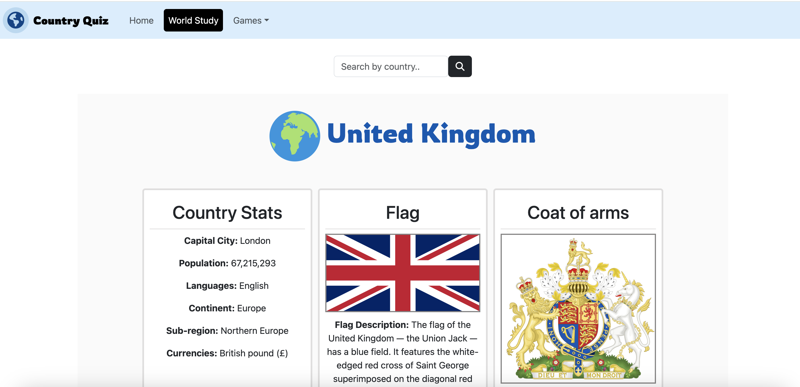

# CountryQuiz-App

CountryQuiz-App is a web-based application designed to challenge users' knowledge of countries around the world. The app features interactive quizzes, including a map-based quiz where users can identify countries by clicking on them. The app is built using JavaScript, HTML, and CSS, and leverages various libraries for enhanced functionality.

https://vilmaglynn.github.io/countryquiz-app/

## Features

Interactive Map Quiz: Click on countries to identify them, and receive immediate feedback.
Country Flag Quiz: Test your knowledge of country flags from around the world.
Capital City Quiz: Challenge yourself to name the capital cities of different countries.
Responsive Design: The app is fully responsive, ensuring a seamless experience on both desktop and mobile devices.
Sound Effects: Enjoy sound effects when interacting with the quiz.
Technologies Used

JavaScript: Core functionality and logic.
HTML5 & CSS3: Structure and styling of the app.
Leaflet.js: Interactive map functionality.
GeoJSON: Geographic data representation.
Bootstrap 5: Responsive design and components.
OpenStreetMap: Map tiles used in the interactive quiz.
GitHub Pages: Hosting platform for the app.

## Usage

Interactive Map Quiz: Load the app and start clicking on countries in the interactive map to test your knowledge.
Other Quizzes: Navigate through the different quizzes using the navbar to test your knowledge of flags and capital cities.

## License

This project is licensed under the MIT License. See the LICENSE file for more details.

## Acknowledgments

Leaflet.js for providing an excellent library for interactive maps.
OpenStreetMap for map tiles.
Bootstrap for responsive design components.
